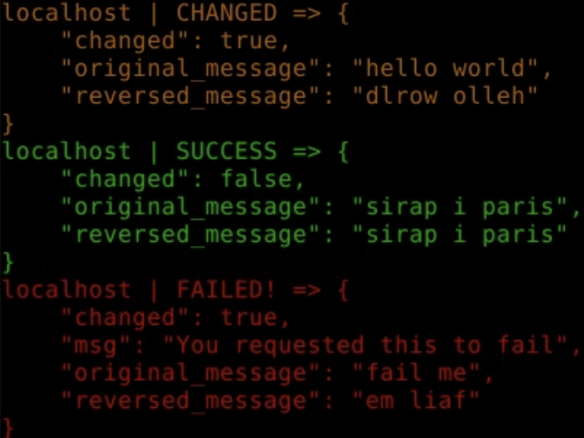

# Examination 18 - Write an Ansible module (VG)

Ansible modules are types of plugins that execute automation tasks on a 'target'. In the previous
examinations you have used many different modules, written by Ansible developers.

A module in Ansible is a Python script that adheres to a particular convention.

You can see the places where Ansible looks for modules by dumping the Ansible configuration
and then search for `DEFAULT_MODULE_PATH`:

    $ ansible-config dump | grep -i module_path

We will now write our own module, and run it through Ansible.

# QUESTION A

Look at [Developing modules](https://docs.ansible.com/ansible/latest/dev_guide/developing_modules_general.html)
and create a module that

* Is called `anagrammer`
* Takes one parameter, `message`, that is a string.
* Returns two values:
    - `original_message` that is the string that is passed through `message`
    - `reversed_message` that is the `message` string, only backwards (reversed).
* If the `original_message` and `reversed_message` is different, the `changed` parameter should be `True`, otherwise
  it should be `False`.

When you are done, you should be able to do

    $ ANSIBLE_LIBRARY=./library ansible -m anagrammer -a 'message="hello world"' localhost

And it should return

    localhost | CHANGED => {
        "changed": true,
        "original_message": "hello world",
        "reversed_message": "dlrow olleh"
    }

You should also be able to do

    ANSIBLE_LIBRARY=./library ansible -m anagrammer -a 'message="sirap i paris"' localhost

And it should return

    localhost | SUCCESS => {
        "changed": false,
        "original_message": "sirap i paris",
        "reversed_message": "sirap i paris"
    }

If you pass in 'fail me', it should fail like this:

    localhost | FAILED! => {
        "changed": true,
        "msg": "You requested this to fail",
        "original_message": "fail me",
        "reversed_message": "em liaf"
    }

### ANSWER:

I first created the module object which defines the expected arguments of the Ansible module. The `argument_spec` parameter specifies these arguments with a dictionary. Each key defines an argument name, such as `message`, while their value is another dictionary that describes the properties of the argument, such as its type and whether it's required for the module to run.

Optional behaviors like `supports_check_mode` can also be set, which tells Ansible if the module can be run in check mode without actually modifying the target hosts. 

The purpose of the AnsibleModule object is to instruct Ansible on how to validate and parse the input data when the module runs.
```python
module = AnsibleModule(
        argument_spec=dict(
            message=dict(type='str', required=True)
        ),
        supports_check_mode=True
    )
```

Each parsed input argument gets stored in `module.params['<name_of_argument>']`. Here I store the argument input in a variable called `message`. The message string then gets reversed and stored in `reversed_message`.
```python
# Get the users message string input
message = module.params['message']

# Reverse the string
reversed_message = message[::-1]
```

I then use a simple if statement to check whether the message actually changed after being reversed. If the input is a palindrome it will return false since the message still ends up being identical. This is the changed state which is returned to the user when the task runs.
```python
    # Determine changed state
    if message != reversed_message:
        changed = True
    else:
        changed = False
```

Next if statement checks if the input message is "fail me". This automatically triggers the `module.fail_json()` function, which immediately stops execution of the task and returns a failure result to Ansible.
```python
# Handle explicit failure
if message == "fail me":
    module.fail_json(
        msg="You requested this to fail",
        changed=True,
        original_message=message,
        reversed_message=reversed_message,
    )
```

In all other cases the `module.exit_json` function is called, which informs Ansible that the task was completed successfully and simply returns the changed state, the original input and reversed message.
```python
# Handle normal success case
module.exit_json(
    changed=changed,
    original_message=message,
    reversed_message=reversed_message
)
```

I made the file executable using:
```bash
chmod +x anagrammer.py
```

I then ran the following commands to confirm it was working and got the expected output:
```python
ANSIBLE_LIBRARY=./library ansible -m anagrammer -a 'message="hello world"' localhost

ANSIBLE_LIBRARY=./library ansible -m anagrammer -a 'message="sirap i paris"' localhost

ANSIBLE_LIBRARY=./library ansible -m anagrammer -a 'message="fail me"' localhost 
```
**Module output:**


# QUESTION B

Study the output of `ansible-config dump | grep -i module_path`. You will notice that there is a directory
in your home directory that Ansible looks for modules in.

Create that directory, and copy the Ansible module you just wrote there, then make a playbook
that uses this module with the correct parameters.

You don't need to worry about FQCN and namespaces in this examination.

### ANSWER:

After running the command `ansible-config dump | grep -i module_path` I got:
```bash
DEFAULT_MODULE_PATH(default) = ['/home/josef/.ansible/plugins/modules', '/usr/share/ansible/plugins/modules']
```

I noticed that it checks for modules in the directory `/home/josef/.ansible/plugins/modules`. I had to created the directory and copied the module into it:
```bash
mkdir -p ~/.ansible/plugins/modules
cp library/anagrammer.py /home/josef/.ansible/plugins/modules/
```


# QUESTION C

Create a playbook called `18-anagrammer.yml` that uses this module.

Make the playbook use a default variable for the message that can be overriden by using something like:

    $ ansible-playbook --verbose --extra-vars message='"This is a whole other message"' 18-custom-module.yml

### ANSWER:

First I create a variable (which can be overriden with the `--extra-vars` or `-e` flag when the playbook is run):
```yaml
vars:
  message: "random"  # Override with --extra-vars or -e
```

I then have two tasks, one of which uses the custom anagrammer module. It has a `message` parameter which passes in the message variable. It stores the modules output in the variable `result`. With the debug module the playbook prints out the contents of the result variable:
```yaml
- name: Run the anagrammer module
  anagrammer:
    message: "{{ message }}"
  register: result

- name: Show the module output
  ansible.builtin.debug:
    var: result
```

# BONUS QUESTION

What is the relationship between the booleans you can use in Python, and the various "truthy/falsy" values
you most often use in Ansible?

What modules/filters are there in Ansible that can safely test for "truthy/falsy" values, and return something
more stringent?

### ANSWER:
The boolean values in Ansible are based on Pythons boolean logic. It follows the same rules that defines truthy or falsy values in Python. For instance, values such as `0`, `None`, an empty string `""` are considered falsy. But Ansible also extends this logic with YAML values that are human friendly such as `yes`/`no`, `on`/`off`.

There are filters that can be used to safely test for truthy or falsy values. Each filter pipes the value into built-in test plugins that converts or evaluates it, such as `ansible.builtin.bool`, `ansible.builtin.truthy`, `ansible.builtin.falsy` and `ansible.builtin.boolean`.
```yaml
when: my_var | bool     # Converts to True/False, not YAML aware
when: my_var | truthy   # Converts to True/False, is YAML aware
when: my_var | falsy    # Inverse of truthy, True for “falsy” values
when: my_var is boolean # Checks type, whether the value is a boolean
```